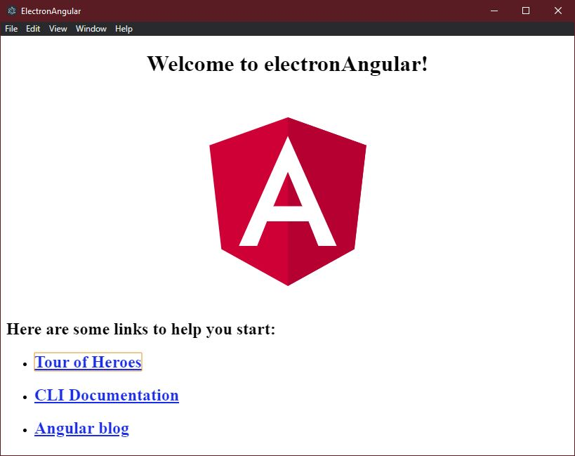

# ElectronAngular

How to integrate Angular inside an Electron application, follow the steps below or just copy the project and use it as a template.

## Making of

These are the steps I did (I use Visual Studio Code, therefore the "code ."):

    ng new electronAngular
    cd electronAngular
    code .
    npm install --save-dev electron
    npm audit fix
    ng build

Create a **main.js** file and copy paste this code:

    const { app, BrowserWindow } = require('electron')

    // Keep a global reference of the window object, if you don't, the window will
    // be closed automatically when the JavaScript object is garbage collected.
    let win

    function createWindow () {
    // Create the browser window.
    win = new BrowserWindow({
        width: 800,
        height: 600,
        webPreferences: {
        nodeIntegration: true
        }
    })

    // and load the index.html of the app.
    win.loadFile('index.html')

    // Open the DevTools.
    win.webContents.openDevTools()

    // Emitted when the window is closed.
    win.on('closed', () => {
        // Dereference the window object, usually you would store windows
        // in an array if your app supports multi windows, this is the time
        // when you should delete the corresponding element.
        win = null
    })
    }

    // This method will be called when Electron has finished
    // initialization and is ready to create browser windows.
    // Some APIs can only be used after this event occurs.
    app.on('ready', createWindow)

    // Quit when all windows are closed.
    app.on('window-all-closed', () => {
    // On macOS it is common for applications and their menu bar
    // to stay active until the user quits explicitly with Cmd + Q
    if (process.platform !== 'darwin') {
        app.quit()
    }
    })

    app.on('activate', () => {
    // On macOS it's common to re-create a window in the app when the
    // dock icon is clicked and there are no other windows open.
    if (win === null) {
        createWindow()
    }
    })

    // In this file you can include the rest of your app's specific main process
    // code. You can also put them in separate files and require them here.

Replace the **win.loadFile(...)** argument with your own path of Angular dist index.html:

    // and load the index.html of the app.
    win.loadFile('dist/electronAngular/index.html')

The **index.html** in src folder needs a **dot** in the **base href argument**:

    <base href="./">

Additionally extend the package.json with two more settings, which are **"main": "main.js"** and **"electron": "ng build && electron ."** ...

    {
    "name": "electron-angular",
    "version": "0.0.0",
    "main": "main.js",
    "scripts": {
        "ng": "ng",
        "start": "ng serve",
        "build": "ng build",
        "test": "ng test",
        "lint": "ng lint",
        "e2e": "ng e2e",
        "electron": "ng build && electron ."
    },

Now run the electron application

    npm run electron

Finally to add your project to a new Github repository:

    git config user.name <yourGithubUser>
    git config user.email <yourGithubEmail>
    git add --all
    git commit -m "initial commit"

## Interesting websites
* [Electron - Writing Your First Electron App](https://electronjs.org/docs/tutorial/first-app)

# More about this angular project

This project was generated with [Angular CLI](https://github.com/angular/angular-cli) version 8.1.0.

## Development server

Run `ng serve` for a dev server. Navigate to `http://localhost:4200/`. The app will automatically reload if you change any of the source files.

## Code scaffolding

Run `ng generate component component-name` to generate a new component. You can also use `ng generate directive|pipe|service|class|guard|interface|enum|module`.

## Build

Run `ng build` to build the project. The build artifacts will be stored in the `dist/` directory. Use the `--prod` flag for a production build.

## Running unit tests

Run `ng test` to execute the unit tests via [Karma](https://karma-runner.github.io).

## Running end-to-end tests

Run `ng e2e` to execute the end-to-end tests via [Protractor](http://www.protractortest.org/).

## Further help

To get more help on the Angular CLI use `ng help` or go check out the [Angular CLI README](https://github.com/angular/angular-cli/blob/master/README.md).
